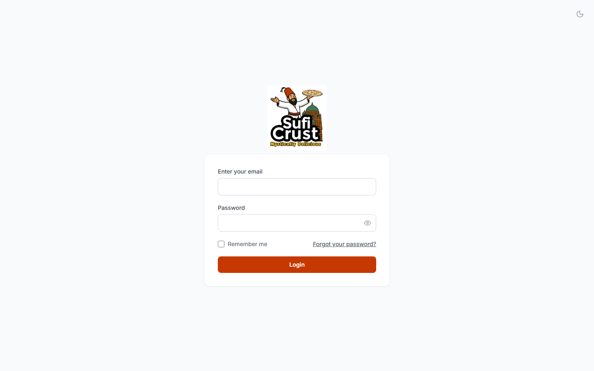
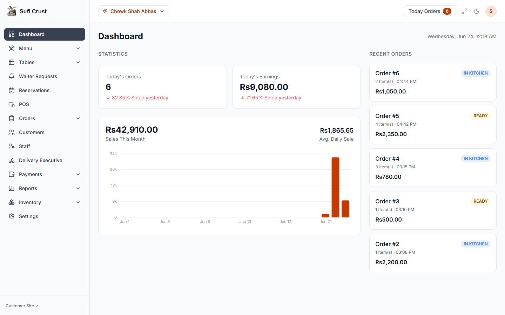
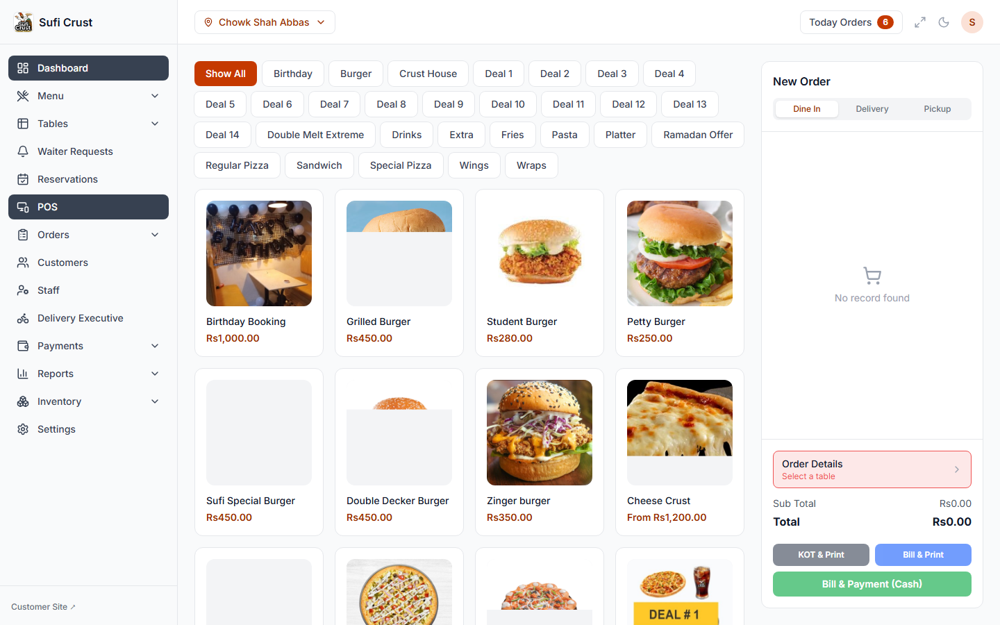
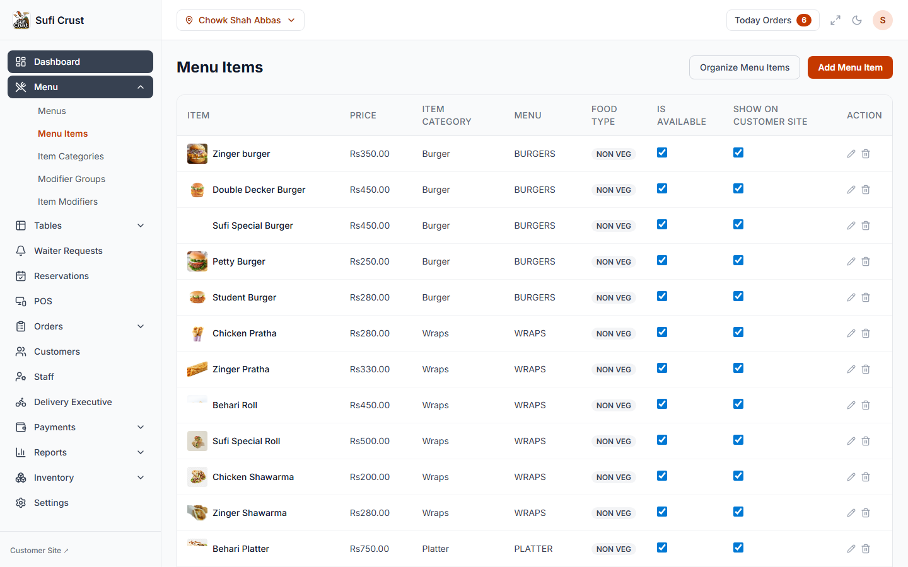

# Sufi Crust POS — Showcase

A few screenshots of our custom-built point-of-sale platform, currently running Sufi Crust's live restaurant operations.

This is a showcase repository only — the application source code lives in a separate, private repository.

## Login

## Dashboard

Real-time stats, monthly sales trend, and recent orders.

## Point of Sale

A simple, visual ordering screen — tap an item, pick a size if it has one, done.

## Menu Management

Full catalog control: items, categories, pricing, and availability per branch.

